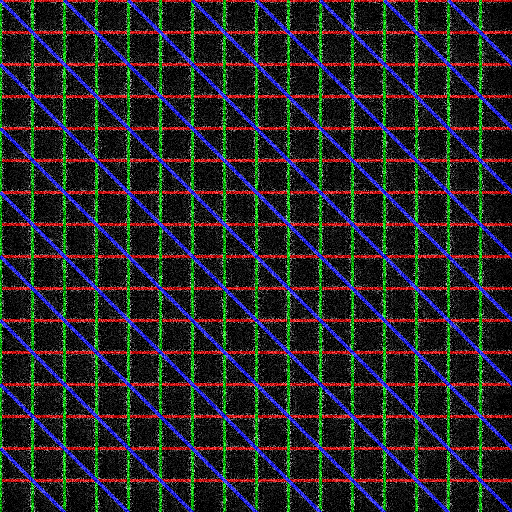
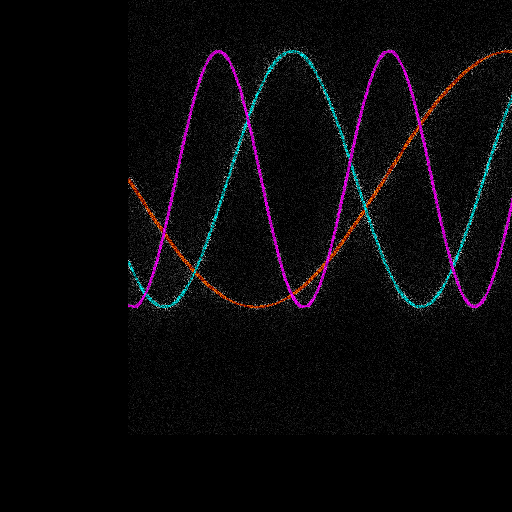

# SLPR

Stochastic Laplacian Pyramid Renderer in Python 3.11.

- Start here: PROJECT_SUMMARY.md (what’s implemented and how to run)
- Concepts: concept.md (algorithm and design goals)
- Roadmap: implemetation_plan.md (milestones and next steps)

Quick start:

1. Create assets:
   - python -m assets.generate_assets
2. Run:
   - python main.py --config config.yaml
   - For quick smoke tests: python main.py --config quick_rgb.yaml or quick_luma.yaml

Outputs appear under `outputs/YYYY-MM-DD_HHMMSS/asset/config/`.

Requirements: see requirements.txt
Dev typing/stubs: see requirements-dev.txt. A pyrightconfig.json is included to reduce type-noise and ignore missing stubs for joblib/tqdm-joblib.

Notes:
- Supports grayscale, RGB, and luma (Y with original Cb/Cr) modes via `global.color_mode`.
- Deterministic when `seed` is set.
- For SSIM, scikit-image must be installed (already in requirements.txt).

Environment & logging:
- The run root (e.g., `outputs/<stamp>/`) contains `environment.json` (Python, platform, numpy, basic env vars) and `resolved_config.json` (fully parsed config) plus a `run.log` with INFO-level logs.
- Adjust verbosity via `global.log_level` in `config.yaml` (DEBUG/INFO/WARN/ERROR).

Progress tracking:
- Outer case processing uses tqdm; inner per-pixel sampling shows level row progress for large outputs (> 256x256) to avoid noisy bars for small runs.

## Scene CLI (frames → GIF/MP4)

Render an animation defined by a scene YAML and assemble outputs:

- python -m slpr.scripts.sr_scene_cli --scene scenes/example_scene.yaml

Options:
- --out-dir /custom/output
- --seed 123
- --levels 5 --patch-size 3 --jitter 1.0 --noise-strength 0.1 --samples 1
- --workers N (defaults to CPU cores)
- --algorithm slpr|cv2_nearest|cv2_linear|cv2_area|cv2_cubic|cv2_lanczos4
- --blend-mode weighted|random (override scene)
- --no-gif / --no-mp4 to skip outputs
 - Scene YAML: border_mode black|white|mirror|repeat|edge (default black), algorithm override, ROI tuning: roi_min_zoom, roi_pad_scale.

A minimal quick test is provided at `scenes/quick_test.yaml`.

Scene YAML extras:
- border_mode: black|white|mirror|repeat|edge (default: black)
- algorithm: slpr (default) or any cv2_* from the CLI choices above
- roi_min_zoom: float to trigger ROI optimization when zoom >= value
- roi_pad_scale: float padding multiplier for ROI context
- slpr_params (scene-level defaults): levels, patch_size, jitter, noise_strength, samples
   - Alternatively, you can place flat keys at the top-level: levels, patch_size, jitter, noise_strength, samples
   - CLI flags still work; precedence: per-keyframe params > CLI overrides > scene-level defaults > library defaults
   - Interpolation: per-keyframe `params` are linearly interpolated per frame (numbers only)

Multi-source scenes:
- inputs: list of sources, e.g.
   - inputs: [{ name: a, path: assets/color_lines.png }, { name: b, path: assets/color_blobs.png }]
- blend_mode: weighted (linear blend) or random (per-pixel categorical using weights)
- Per-keyframe weights can be provided and are interpolated across the phase:
   - start: { ..., weights: { a: 1.0, b: 0.0 } }
   - end:   { ..., weights: { a: 0.0, b: 1.0 } }

Example:
- scenes/crossfade_two_images.yaml shows a simple crossfade then zoom using SLPR.

Per-keyframe parameter overrides (example snippet):

   phases:
      - duration_sec: 1.0
         start:
            u: 0.5; v: 0.5; zoom: 1.0
            weights: { a: 1.0, b: 0.0 }
            params: { noise_strength: 0.03, jitter: 0.5, patch_size: 3 }
         end:
            u: 0.5; v: 0.5; zoom: 1.0
            weights: { a: 0.0, b: 1.0 }
            params: { noise_strength: 0.03, jitter: 0.5, patch_size: 3 }
      - duration_sec: 1.0
         start:
            u: 0.5; v: 0.5; zoom: 1.0
            weights: { a: 0.0, b: 1.0 }
            params: { noise_strength: 0.06, jitter: 0.8, patch_size: 3 }
         end:
            u: 0.5; v: 0.5; zoom: 4.0
            weights: { a: 0.0, b: 1.0 }
            params: { noise_strength: 0.18, jitter: 1.5, patch_size: 5 }

Scene-level defaults (optional):

   slpr_params:
      levels: 5
      patch_size: 3
      jitter: 1.0
      noise_strength: 0.1
      samples: 1

Notes:
- Changing `levels` mid-scene forces rebuilding pyramids (slower). Other params reuse existing pyramids.

## Showcase

Three ready-to-run demos under `scenes/`:

1) Weighted crossfade + zoom with grain ramp
   - Scene: `scenes/showcase_crossfade_zoom.yaml`
   - Run: python -m slpr.scripts.sr_scene_cli --scene scenes/showcase_crossfade_zoom.yaml --seed 123 --out-dir outputs/showcase/crossfade_zoom
   - Output: `outputs/showcase/crossfade_zoom/animation.gif`
   
   

2) Random blend (categorical mask) between sources
   - Scene: `scenes/showcase_random_blend.yaml`
   - Run: python -m slpr.scripts.sr_scene_cli --scene scenes/showcase_random_blend.yaml --seed 123 --out-dir outputs/showcase/random_blend
   - Output: `outputs/showcase/random_blend/animation.gif`
   
   

3) Extreme zoom using ROI optimization
   - Scene: `scenes/showcase_roi_zoom.yaml`
   - Run: python -m slpr.scripts.sr_scene_cli --scene scenes/showcase_roi_zoom.yaml --seed 123 --out-dir outputs/showcase/roi_zoom
   - Output: `outputs/showcase/roi_zoom/animation.gif`
   
   

If you change assets, regenerate via: python -m assets.generate_assets

## Roadmap
See implemetation_plan.md for milestones:
- Production API (arrays only) and tests
- Scene system + CLI with border modes and algorithm selector
- ROI optimization for large zooms
- Multi-source blending (weighted/random) and video inputs (next)